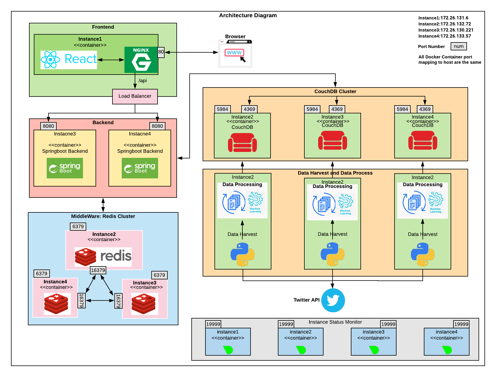
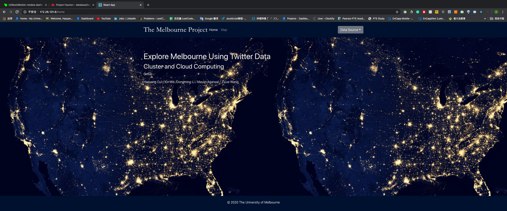
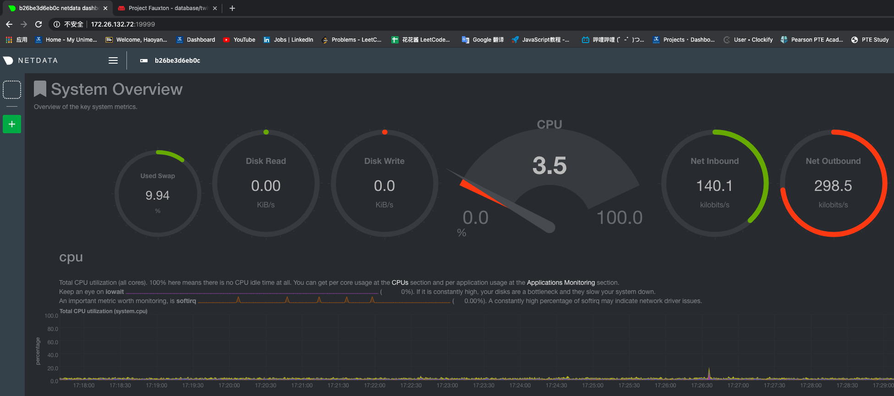

# CCCProject2  

## Team Members:
Haoyang Cui - haoyangc@student.unimelb.edu.au
Xin Wu - wux14@student.unimelb.edu.au

## Videos and Documentation
Youtube link:

Slides:

## System Architecture



### Explanation:

### DB
* **Data Harvest**:
Continuously collect data from Twitter, via tweepy's Search API and Stream API
* **Data Processing**:
Process data collected and store into couchDB, NLP library is used here to analysis sentiment from twitter text
* **CouchDB**:
CouchDB cluster is built upon three different instances, multiple MapReduces are provided for data query


### Middleware

### Backend

### Frontend


## Ansible Playbook Deployment

### openstack key

```
MTFjM2E4MWE3Mjk3NGVi
```

### step 1 create VMs
```
./create_VMs.sh
```
Sub-steps inside:
* create volumes
* set security-group
* create instances

After created, we can get four instances:


### step 2 set VMs environment
```
./set_environment.sh
```
Sub-steps inside:
* set-proxy
* mount-volumes
* install-docker

### step 3 cluster CouchDB
```
./couchdb_cluster.sh
```
Three nodes will be configured as a couchDB cluster, the membership could be checked by executing the commend:
```
curl admin:123456@172.26.132.72:5984/_membership
```
and the result will look like below:


Instance2, instance3 and instance4 have be successfully clustered.

### step 4 Deploy all applications and components
```
./DeployAllApplications.sh
```
SUb-steps includes:
* deploy netData component for server status monitoring
* Set Map Reduce and Data harvest
* Set Redis cluster as Middleware
* Deploy springboot backend
* Deploy frontend together with nginx configuring

After this step, all required components should be successfully deployed, they may look like below:

couchDB:


web:


Server Status Monitor:



## All Instacnes Arrangement

Instance1: 172.26.131.6
* frontend
* nginx
* Server Status Monitor
* grafana

Instacne2: 172.26.132.72
* CouchDB Cluster (masternode)
* Redis
* Data Harvester
* Server Status Monitor

Instance3: 172.26.130.221
* Backend1
* CouchDB Cluster (subnode1)
* Redis
* Data Harvester
* Server Status Monitor

Instance4: 172.26.133.57
* Backend2
* CouchDB Cluster (subnode2)
* Redis
* Data Harvester
* Server Status Monitor
